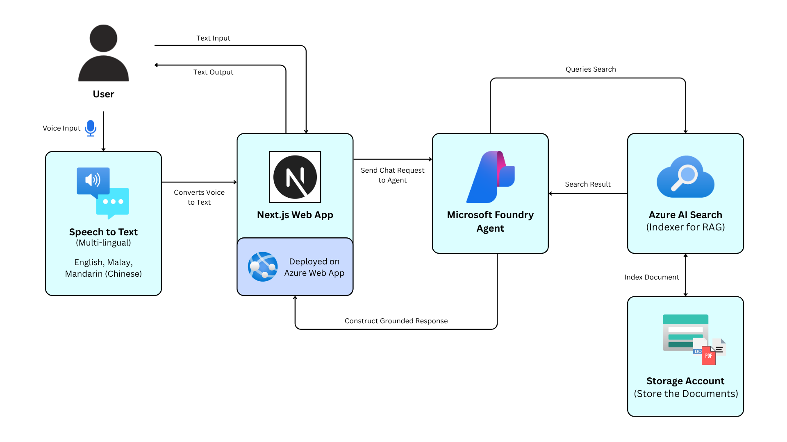
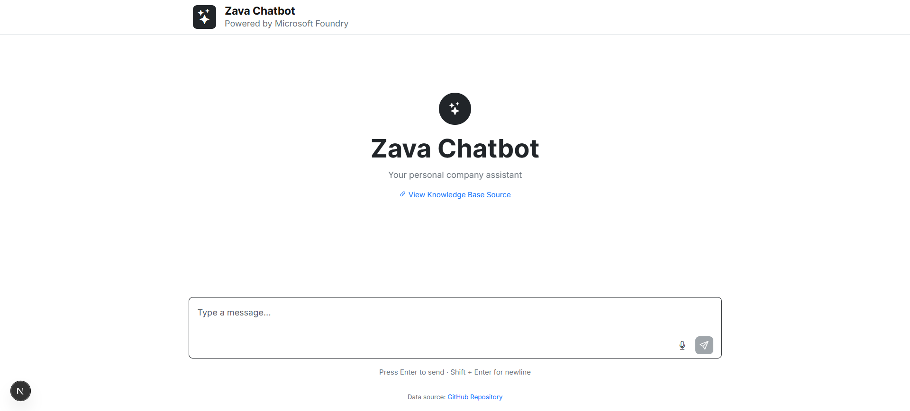
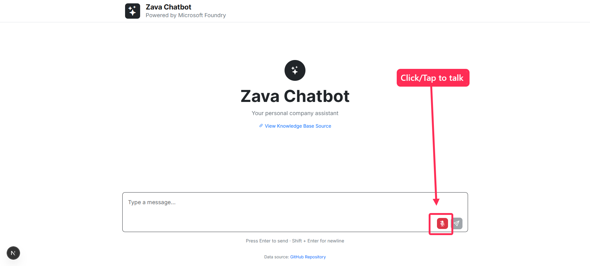
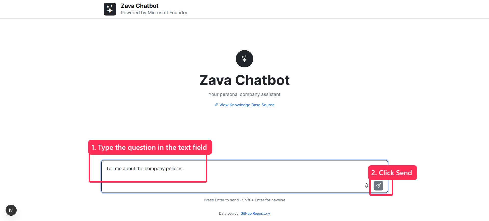
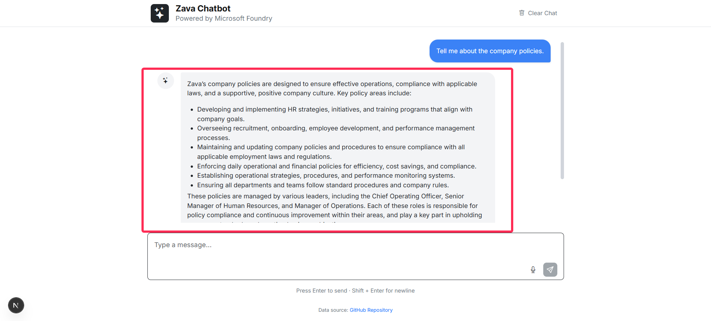
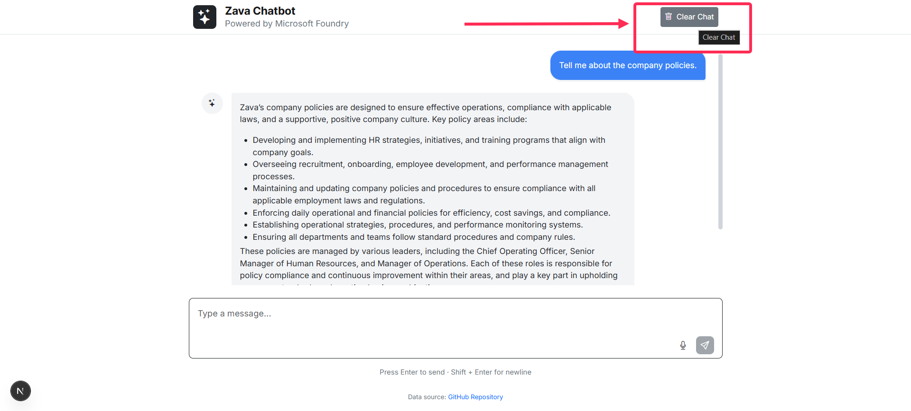

# 🤖 Voice-Enabled RAG Agent for Microsoft Foundry
An enterprise-ready, multilingual RAG (Retrieval-Augmented Generation) chatbot built with Next.js and powered by the Microsoft Azure AI ecosystem. This project features speech-to-text capabilities, seamless document retrieval via Azure AI Search, and highly secure resource connectivity using Azure Managed Identities.


## 📖 Overview
This project provides a complete end-to-end web application that allows users to interact with a grounded AI agent. Users can communicate via text or voice in English, Malay, or Mandarin. The voice input is transcribed and sent to an AI agent hosted in Azure AI Foundry. To ensure the AI provides accurate and context-aware responses, it leverages Azure AI Search as an indexer to retrieve information from a dedicated knowledge base.

The entire solution is deployed on Azure Web Apps, utilizing Managed Identities to completely eliminate the need for hardcoded credentials when connecting Azure resources.


## ✨ Key Features
- **Multilingual Voice Input:** Real-time Speech-to-Text supporting English, Malay, and Mandarin using Azure Speech Services.
- **Retrieval-Augmented Generation (RAG):** Grounded AI responses using Azure AI Search to query internal documents/knowledge bases.
- **Intelligent Agent:** Powered by Azure AI Foundry to orchestrate natural language understanding and response generation.
- **Secure by Default:** Zero-secret architecture. All communication between the Web App, AI Foundry, and AI Search utilizes Azure Managed Identity.
- **Modern Web UI:** Built on the Next.js framework for a highly responsive, server-side rendered, and optimized user experience.


## 🏗️ Architecture



## 💻 Tech Stack
- **Frontend & API**: [Next.js](https://nextjs.org/) (React Framework)
- **AI Orchestration**: Microsoft Foundry
- **Vector Search / Indexer**: Azure AI Search
- **Voice Transcription**: Azure Cognitive Services (Speech-to-Text) / Microsoft Foundry AI Service
- **Deployment**: Azure App Service (Web App)
- **Storage**: Azure Blob Storage


## 📋 Prerequisites
Before setting up the project locally, ensure you have the following installed:
- [Node.js](https://nodejs.org/en/) (v18 or higher)
- [Azure CLI](https://docs.microsoft.com/en-us/cli/azure/install-azure-cli) (For local Managed Identity simulation)
- An active Azure Subscription with the necessary AI Foundry, AI Search, and Speech resources provisioned.


## ⚙️ Environment Variables
Create a `.env.local` file in the root directory (`ragchatbot-tts`) and configure the following variables.
```
# Azure AI Foundry Settings
FOUNDRY_PROJECT_ENDPOINT="https://<your-resource-name>.services.ai.azure.com/api/projects/<your-project-name>"
AZURE_OPENAI_API_KEY="<your-azure-openai-api-key>"
AZURE_OPENAI_DEPLOYMENT_NAME="<your-deployment-name-e.g-gpt-4o>"
AZURE_OPENAI_AGENT_ID="<your-agent-id>"

# Azure Speech Services
AZURE_SPEECH_KEY="<your-azure-speech-key>"
AZURE_SPEECH_REGION="<your-region-e.g-southeastasia>"
```


## 🚀 Local Setup
**1. Clone the repository:**
```cmd
git clone https://github.com/Muhammad-Idzhans/RAGChatbot-TextToSpeech.git
```
```cmd
cd ragchatbot-tts
```

**2. Install dependencies**
```cmd
npm install
```

**3. Authenticate with Azure CLI:**

To test Managed Identity connections locally, log in to the Azure CLI using an account that has role assignments (e.g., Cognitive Services User, Search Index Data Reader) for your resources.
```cmd
az login
```

**4. Run the develoopment server:**
```cmd
npm run dev
```

**5. Access the application:**

Open [http://localhost:3000](http://localhost:3000) in your web browser.


## ☁️ Deployment to Azure Web App

Deploying this application to Azure Web App requires a specific set of configurations to handle the Next.js standalone build properly.

**1. Create the Azure Web App:**
In the Azure Portal, create a new Web App with the following settings:
- **Publish:** Code
- **Runtime stack:** Node 22 LTS *(Node 20 LTS is reaching EOL end of April)*
- **Operating System:** Linux
- **Region:** Choose your preferred region
- **Pricing Plan:** Select your appropriate Linux plan

**2. Configure Deployment:**
- During creation or via the **Deployment Center** tab, enable **Continuous Deployment**.
- Select your GitHub account and choose the repository and branch.
- Once finished, Azure will automatically generate a `.github/workflows` folder with a `.yml` file in your repository.

**3. Edit the GitHub Actions Workflow:**
You need to modify the generated `.yml` file to properly handle the Next.js standalone build structure. Ensure your build step includes the logic to flatten the standalone directory and copy the necessary static files. *(Reference the `main_chatbot-rag-tts.yml` in this repository for the exact script used to flatten the `.next/standalone/ragchatbot-tts` directory and copy `public`/`.next/static` files).*

**4. Configure Environment Variables:**
In the Azure Portal, navigate to your Web App's **Settings** -> **Environment variables**. Add all the keys from your `.env.local` file. 
- *Note: Ensure you enter the variable values exactly as they are, without surrounding quotes (`""`).*

**5. Update the Startup Command:**
To tell Azure how to start the standalone Next.js server:
- Navigate to **Settings** -> **Configuration** -> **Stack Settings** tab.
- Locate the **Startup Command** field.
- Enter exactly: `node server.js`
- Save the changes.

**6. Configure Managed Identity (Crucial for Security):**
To ensure the Web App can securely communicate with the Azure AI ecosystem without hardcoded credentials:
- In your Web App, navigate to **Settings** -> **Identity**.
- Under the **System assigned** tab, set the **Status** to **On** and save.
- **Assign Roles:** Go to your **Azure AI Foundry Project**, navigate to the access control settings, and add the Web App's Managed Identity as an **Azure AI Developer** (or an equivalent AI User role) to grant it access to the project's resources.

**7. Monitor and Access:**
- Check the **Log stream** under the **Monitoring** section to ensure the application starts correctly and there are no errors during the `node server.js` execution.
- Once the logs confirm a successful startup, navigate to the **Overview** page and click the **Default domain** link to open your deployed application.


## 🖱️ Usage Guide

**1. Access the Chatbot**
Open your browser and navigate to your deployed Azure Web App URL (or `http://localhost:3000` for local testing).



**2. Ask a Question**
- **Voice Mode:** Click the microphone icon and speak your question. The Azure Speech-to-Text service will automatically transcribe your voice into the text area.

- **Text Mode:** Simply type your question into the input box and hit send.


**3. Receive Grounded Answers**
The AI agent will process your input, search the grounded knowledge base using Azure AI Search, and return an accurate, context-aware response based on the retrieved documents.



**4. Clear Chat**
Click the trash can icon to clear the chat history.


---

<div align="center">
  <em>Developed by Muhammad Idzhans Khairi</em>
</div>